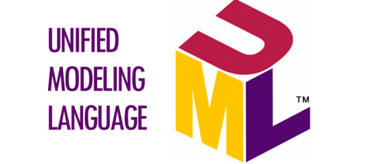

#**Diagrammes UML**

Communiquer dans une équipe de métiers divers où chacun vient avec son vocabulaire peut être challenging. Les diagrammes UML permettent d'**identifier et banaliser les process à incorporer dans un projet**.

Il y a plusieurs types de diagrammes.
Certains permettent de définir les visions globales d'un produit. D'autres de définir de façon très détaillée les intéractions entre les différents éléments de ce produit. C'est cet exercice d'analyse en profondeur qui va permettre de mieux définir son produit.

> _**Note :**_
> _Ce cours se situe dans le cadre d'un case study sur la réalisation d'un projet de SaaS : Fixeez ( un service d'ubérisation de réparation vélo ). Il peut cependant être utilisé pour un projet avec des contraintes techniques différentes de celles du case study._

**Requirements** : Il vous faudra un logiciel pour faire vos diagrammes.
 + le plus spécifique et celui utilisé dans les exemples : [StarUML](http://staruml.io/).
 + le plus polyvalent (UML et wireframes) : [Balsamiq](https://balsamiq.com/).

----------

##Step 1 - Le diagramme des cas d'utilisations ou use-case

Le [use-case](https://github.com/simplonco/UML-Use-Case), comme son nom l'indique, permet de définir toutes les utilisations du produit.

----------

##Step 2 - Le diagramme de séquence

Le [diagramme de séquence](https://github.com/simplonco/UML-Sequence) permet de séquencer ces utilisations sur une timeline.

----------

##Step 3 - Le diagramme d'intéraction

Le [diagramme d'intéraction](https://github.com/simplonco/UML-Interaction) permet de définir la navigatipon intégrale d'un utilisateur sur le service.

----------

##Step 4 - Le diagramme de classe

Le [diagramme de classe](https://github.com/simplonco/UML-class) permet presque de pré-coder son app. Il va définir chaque acteurs/objets, leurs propriétés et méthodes. Une super guideline pour avancer dans son projet.
